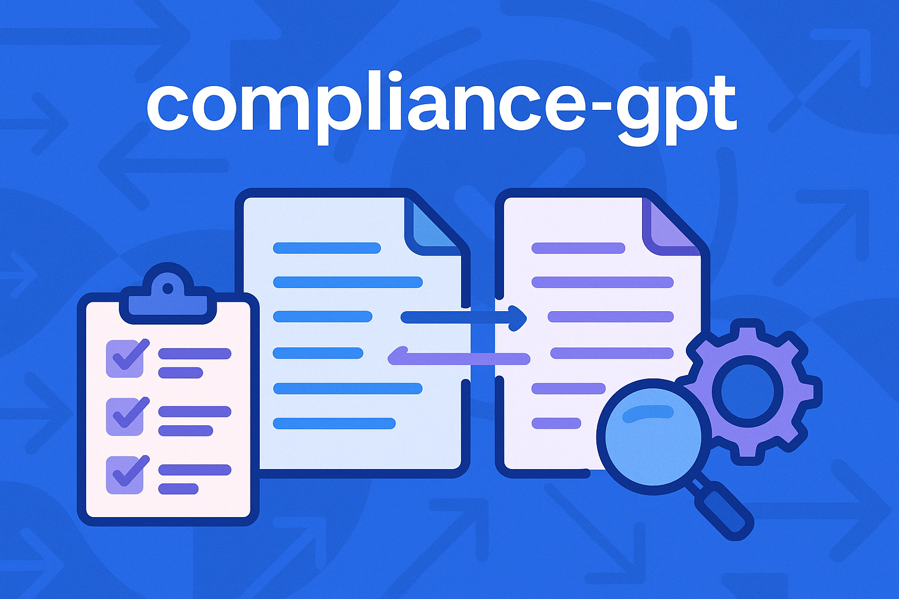

  

# compliance-gpt

**AI-assisted plan document compliance** — automate the reconciliation, exception tracking, and sign-off workflows that preserve **qualified plan** status during recordkeeper conversions and Cycle restatements.

## The problem

When retirement plans move providers or restate onto a new IRS pre-approved document cycle, compliance teams must:
- Maintain reliance under **IRC §401(a)** (tax qualification)
- Evidence ERISA / DOL obligations (written plan, records, disclosures)
- Prove the new document **still says what the old plan said** (or that deliberate changes were approved)

Today this is done manually with Word redlines, Excel spreadsheets, and email chains. It's error-prone, slow, and doesn't scale.

## What compliance-gpt does

compliance-gpt automates the four-control framework defined in [`/process`](./process/):

1. **Plan Qualification** — verify document lineage and Opinion Letter reliance
2. **Document Reconciliation** — AI-powered provision mapping and variance detection
3. **Exception Handling** — structured tracking of deviations to closure
4. **Sign-off** — automated execution package assembly and audit trail

## Status

**Phase 1 Design Complete** (Oct 17, 2025)

✅ Process framework defined
✅ Market research completed
✅ Functional requirements drafted
✅ **Technical design complete** — architecture, data models, LLM strategy

**Next:** Phase 2 POC (Proof-of-Concept) to validate semantic provision mapping accuracy

## Repo map

- **[`/process`](./process/README.md)** — the four-control compliance framework (the "spec")
- **[`/requirements`](./requirements/README.md)** — functional requirements for MVP (doc-to-doc comparison focus)
- **[`/research`](./research/)** — market research on existing TPA tools and AI opportunities
- **[`/design`](./design/README.md)** — technical architecture, data models, and LLM strategy ✨ **NEW**

### Design Highlights

**Model Selection:** Claude Sonnet 4.5 + hybrid embeddings architecture
**Data Storage:** SQLite (queryable, transactional, local-first)
**UI Strategy:** CLI-first POC → Web UI MVP → Docker deployment
**Expected Accuracy:** 75-90% automation (vs 4-8 hours manual)
**Cost Estimate:** ~$1.12 per document pair

See [`/design/README.md`](./design/README.md) for complete architecture and design decisions.
