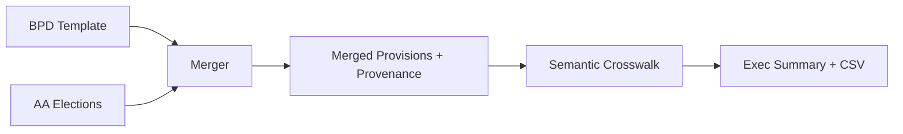
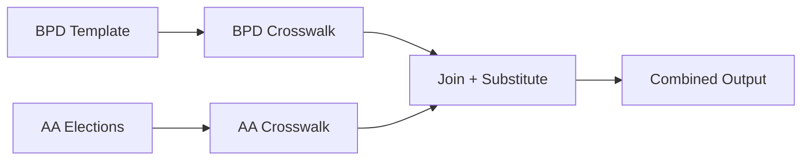

# ADR-001: BPD+AA Merger Strategy for Semantic Crosswalk

**Status:** Proposed
**Date:** 2025-10-30
**Deciders:** Sergio DuBois, Claude (AI Assistant)
**Consulted:** Lauren Leneis (Advisor)

---

## Context and Problem Statement

Plan documents consist of two components: BPD (Base Plan Document template) and AA (Adoption Agreement elections). Many provisions in the BPD are **election-dependent** — their semantic meaning changes based on values selected in the AA.

**Example:**
```
BPD: "Combined Account means... (1) Employer contributions in the case of
      a Profit Sharing Plan or (2) Employer Nonelective Contributions in
      the case of a 401(k) Profit Sharing Plan."

AA: [✓] 401(k) Profit Sharing Plan

Merged: "Combined Account means... Employer Nonelective Contributions."
```

Comparing BPD templates without elections misses **semantic variances** that affect participant rights and plan qualification. We must decide: should we merge BPD+AA **before** or **after** semantic crosswalk?

---

## Definitions

| Term | Definition |
|------|------------|
| **BPD** | Base Plan Document / Basic Plan Document — IRS pre-approved vendor template with conditional language and election placeholders |
| **AA** | Adoption Agreement — employer-specific elections, checkboxes, and fill-in fields that customize the BPD template |
| **Election-dependent provision** | Any BPD provision whose semantics change based on AA field values (e.g., "if elected," "as specified in AA," conditional clauses) |
| **Merge** | Deterministic substitution + normalization process producing a single provision text representing "what the plan says," with full provenance tracking (BPD sections + AA fields) |
| **Crosswalk** | Vendor-agnostic semantic alignment of provisions (1-to-1, 1-to-many, gaps) with confidence scores and variance classification |
| **Semantic variance** | Material difference in provision meaning that affects participant rights, contribution calculations, or plan qualification (not just wording/formatting) |

---

## Assumptions

1. **Extraction quality:** BPD/AA extraction is ≥95% accurate (section IDs, headings, field labels, provision text)
2. **Anchor mapping:** We can map AA fields to BPD provisions via explicit references (e.g., "as elected in AA §1.04") or stable patterns (keyword windows, vendor-specific lexicons)
3. **Out of scope for MVP:**
   - Legal interpretation beyond plain substitution and normalization
   - Document redline generation (Word track changes)
   - Summary Plan Materials (SMM) or Notice generation
   - Real-time collaboration or multi-user editing

---

## Decision Drivers

1. **Semantic accuracy** — Compliance domain requires high material variance recall at high precision; false reassurance is a qualification risk
2. **Cross-vendor capability** — Market differentiation requires comparing provisions across vendors with different template structures
3. **Domain alignment** — TPAs think in terms of "what does the COMPLETE plan say," not "what does template say + separately what elections say"
4. **Real-world pain points** — Market research identified missed election-dependent variances (e.g., HCE safe harbor inclusion) as costly errors
5. **Auditability** — Regulators and sponsors require provenance: which BPD sections + AA fields produced each finding

---

## Considered Options

### Option A: Merge-Then-Crosswalk



**Process:**
1. Source BPD + Source AA → Merged Source Provisions
2. Target BPD + Target AA → Merged Target Provisions
3. Semantic Crosswalk (Merged Source → Merged Target)
4. Single CSV output with variance classification

### Option B: Crosswalk-Then-Merge



**Process:**
1. BPD Crosswalk (Source BPD → Target BPD) → CSV 1
2. AA Crosswalk (Source AA → Target AA) → CSV 2
3. Join crosswalks + substitute elections → Combined output

### Option C: Hybrid (Both Views)

**Process:**
1. Execute Option B (separate BPD and AA crosswalks)
2. ALSO execute Option A (merged crosswalk)
3. Report all three with reconciliation: "BPD template changes: X, AA election changes: Y, Combined semantic impact: Z"

---

## Trade-Off Analysis

| Dimension | Merge-Then-Crosswalk (A) | Crosswalk-Then-Merge (B) | Hybrid (C) |
|-----------|-------------------------|-------------------------|------------|
| **Material Variance Recall** | Higher (captures election-dependent semantics) | Lower (misses cross-reference impacts) | Higher (merger provides ground truth) |
| **False Reassurance Risk** | Lower (detects when elections change meaning) | Higher (template match ≠ provision match) | Lower (merger catches gaps) |
| **Implementation Complexity** | Higher (merger logic + provenance tracking) | Lower (crosswalks already working) | Highest (maintain two pipelines) |
| **Debugging** | Harder (merger bugs affect crosswalk quality) | Easier (validate BPD/AA crosswalks independently) | Medium (can compare outputs) |
| **Incremental Progress** | Blocked until merger MVP complete | Immediate (BPD crosswalk already done) | Immediate (run Option B while building A) |
| **Computational Cost** | Lower (compare only relevant provisions) | Higher (2× inference passes: BPD + AA separately) | Highest (3× inference: BPD + AA + merged) |
| **Cross-Vendor Alignment** | Supported (merged provisions are vendor-agnostic) | Fragile (vendor template structures diverge) | Supported (merger handles sectioning differences) |
| **Auditability** | Stronger (full provenance: BPD + AA → finding) | Weaker (provenance split across two CSVs) | Strongest (multiple views with reconciliation) |
| **User Cognitive Load** | Lower (single "what changed" report) | Higher (reconcile two separate reports mentally) | Medium (three views, but clear precedence) |

**Footnote:** "Higher/Lower" measured by Δ-recall/precision on golden set (see Evaluation Plan below).

---

## What "Merge" Means: Mechanics and Provenance

### Anchor Finding
Link AA field(s) to BPD clause(s) via:
- **Explicit references:** "as elected in Adoption Agreement §1.04"
- **Keyword windows:** Pattern matching within ±3 sentences (e.g., "waiting period" → AA.Q12.waiting_period_months)
- **Vendor-specific lexicons:** Relius uses "Nonelective," ASC uses "Employer Contribution" (synonym maps)

### Substitution Strategy
1. **Enumerations:** Text templating (if option C selected, drop A/B/D clauses)
2. **Parameters:** Injection (replace `[___]%` with `3%`)
3. **Conditionals:** Guarded rewriting ("if elected under AA §X" → resolve true/false, include/remove block)

### Normalization
- Expand defined terms (e.g., "HCE" → "Highly Compensated Employee")
- Collapse synonyms (vendor-specific terminology → canonical form)
- Standardize numerics ("3%" vs "three percent" → "0.03")

### Provenance Tracking
Every merged provision carries:
- `bpd_section_ids[]` — source BPD sections
- `aa_field_ids[]` — source AA fields/questions
- `merge_rule_id` — which rule performed the merge
- `diff/rationale` — what changed during substitution

### Failure Handling
If anchor or election is ambiguous/missing:
- Emit `merge_status: "needs_review"`
- Surface in executive summary under "Requires Manual Review"
- Include reasoning (e.g., "AA §2.04 referenced but not found")

---

## Data Models

### MergedProvision

```json
{
  "merged_provision_id": "prov_rel_1.12_a_003",
  "canonical_key": "eligibility.waiting_period",
  "text_merged": "Employees are eligible after 3 months of service and attainment of age 21.",
  "source_vendor": "Relius",
  "provenance": {
    "bpd_sections": ["REL-BPD §1.12(a)", "REL-BPD §1.12(b)"],
    "aa_fields": ["AA.Q12.waiting_period_months", "AA.Q12.minimum_age"],
    "merge_rule_id": "merge_rule_elig_wait_v1",
    "merge_timestamp": "2025-10-30T14:05:22Z"
  },
  "elections": {
    "waiting_period_months": 3,
    "minimum_age": 21,
    "entry_frequency": "monthly"
  },
  "merge_status": "ok|needs_review|missing_election",
  "confidence": 0.92,
  "normalizations": ["percent_to_decimal", "synonym_collapse_nonelective"],
  "hash": "sha256:7f3a9b..."
}
```

### CrosswalkResult

```json
{
  "crosswalk_result_id": "xwalk_001_234",
  "source_merged_provision_id": "prov_rel_1.12_a_003",
  "target_merged_provision_id": "prov_asc_2.4_b_001",
  "relation": "equivalent|narrower|broader|conflict|no_match",
  "variance_classification": "None|Administrative|Design|Regulatory",
  "impact_level": "Low|Medium|High",
  "rationale": "Thresholds equal (3 months, age 21); entry dates aligned (monthly); vesting unaffected.",
  "features": {
    "threshold_delta_months": 0,
    "age_delta_years": 0,
    "timing_delta_days": 0
  },
  "confidence": 0.88,
  "explain_snippets": [
    "Source: 'after 3 months of service and attainment of age 21'",
    "Target: 'eligible upon completing 3 months and reaching age 21'"
  ],
  "audit": {
    "run_id": "2025-10-30T14:05Z",
    "model": "gpt-5-mini",
    "prompt_version": "semantic_mapping_v2"
  }
}
```

---

## Merge Rules Catalogue (MVP Patterns)

| Rule ID | Pattern | Example |
|---------|---------|---------|
| **Pattern-01** | Direct anchor | "as elected in Adoption Agreement §1.04" → direct field lookup |
| **Pattern-02** | Checkbox enumeration | If option C selected, drop clauses A/B/D; keep C clause only |
| **Pattern-03** | Numeric thresholds | Replace `[___]%` with `3%`; standardize to decimal (0.03) |
| **Pattern-04** | Optional clauses | "if elected under AA §2.3" → include/exclude entire block |
| **Pattern-05** | Vendor synonyms | "Nonelective" (Relius) ↔ "Employer Contribution" (ASC) → normalize to canonical term |
| **Pattern-06** | Cross-clause propagation | AA election changes definition scope → propagate to dependent BPD clauses |
| **Pattern-07** | Plan type conditional | "in the case of a 401(k) Plan" → resolve based on AA plan type election, remove other branches |
| **Pattern-08** | Defined term expansion | "HCE" → "Highly Compensated Employee (as defined in IRC §414(q))" |
| **Pattern-09** | Date/period normalization | "three months" vs "90 days" vs "3 months" → standardize to days (90) |
| **Pattern-10** | Safe harbor detection | "QACA" election → propagate vesting/notice requirements to dependent provisions |

---

## Phased Implementation Plan

### Phase 1: Concept Proof (2-3 days)

**Scope:**
- 5 election-heavy provision domains: Eligibility, Compensation, Match Formula, Vesting, HCE/Top-Heavy
- Manually create merged provisions for 20-item golden set (10 Relius, 10 Ascensus)
- Run crosswalk on merged vs template-only
- Compare variance detection quality

**Exit Criteria:**
- On 20-provision golden set, **merged** crosswalk beats template-only by **≥20% recall** on material variances at **≥0.85 precision**
- All discrepancies classified by cause (extraction error, merger rule gap, LLM reasoning failure)

**Artifacts:**
1. Golden set JSON (`test_data/golden_set/merged_provisions_v1.json`)
2. Side-by-side comparison report (merged vs template-only findings)
3. Error taxonomy with frequencies (e.g., "Anchor ambiguous: 12%", "AA field missing: 8%")

**Deliverable:** `/test_results/phase1_merge_proof_YYYY-MM-DD.md`

---

### Phase 2: Smart Merger MVP (4-6 days)

**Scope:**
- Implement top 10 merger patterns per vendor (Relius, Ascensus)
- Pattern matching via regex + semantic anchors (embeddings for fuzzy keyword windows)
- Provenance tracking and failure classification
- Handle common edge cases (multiple elections → single provision, optional clauses, plan type conditionals)

**Exit Criteria:**
- Auto-merge **≥80%** of high-impact provisions (eligibility, compensation, contributions, vesting, distributions)
- Unresolved cases explicitly flagged with `merge_status: "needs_review"` and specific reasons
- Median merge time **<50ms/provision** on representative sample (n=100)
- Provenance complete for all merged provisions (bpd_section_ids + aa_field_ids populated)

**Artifacts:**
1. Merge rule catalog (`/design/data_models/merge_rules_v1.md`)
2. Provenance specification (`/design/data_models/provenance_spec.md`)
3. Failure taxonomy (`/test_results/merger_failure_analysis.csv`)

**Deliverable:** `/src/merging/smart_merger.py` with unit tests

---

### Phase 3: Full Pipeline Integration (2-3 days)

**Scope:**
- Integrate merger into extraction → crosswalk pipeline
- Run full merged crosswalk (Relius BPD+AA → Ascensus BPD+AA)
- Generate executive summary with merged variance findings
- Performance optimization (caching, parallelization)

**Exit Criteria:**
- End-to-end run on one source vendor → one target vendor completes in **<1 hour** (150-page plan set)
- Executive report includes:
  - Total provisions compared, match rate, variance breakdown (Administrative/Design/Regulatory)
  - High-impact variances with provision text snippets and rationale
  - "Needs Review" items with specific reasons
  - Confidence distribution histogram
- Reproducible runbook (CLI commands, expected outputs, timing benchmarks)

**Artifacts:**
1. Full crosswalk CSV (`test_results/crosswalk_relius_ascensus_merged_YYYY-MM-DD.csv`)
2. Executive summary PDF (`test_results/exec_summary_YYYY-MM-DD.pdf`)
3. Performance report (extraction time, merge time, crosswalk time, total cost)

**Deliverable:** Demo-ready end-to-end pipeline

---

## Evaluation Plan

### Golden Set Construction
- **5 plans × 2 vendors** (Relius, Ascensus) = 10 complete plan documents
- **200 provisions** manually labeled with:
  - Election dependence (Yes/No + which AA fields)
  - Semantic class (eligibility, compensation, contributions, vesting, distributions, testing, other)
  - Target equivalence (equivalent, narrower, broader, conflict, no_match)
  - Variance classification (None, Administrative, Design, Regulatory)
  - Impact level (Low, Medium, High)

### Metrics

**1. Variance Recall/Precision**
- Material changes (affects participant rights, contribution calculations, or qualification)
- Measured separately for: eligibility, compensation, contributions, vesting
- Target: ≥0.85 precision, ≥0.80 recall

**2. Merge Coverage**
- % provisions auto-merged vs flagged "needs_review"
- Target: ≥80% coverage for high-impact provisions
- Breakdown by provision type and vendor

**3. Explainability Quality**
- Human rater score (1-5 scale) on 20 sampled crosswalk results
- Criteria: clarity, specificity, evidence-based reasoning
- Target: ≥4.0 mean score

**4. Confidence Calibration**
- High-confidence (≥90%) findings should be ≥90% accurate
- Medium-confidence (70-89%) findings should be 70-89% accurate
- Track calibration drift over time

### Ablation Studies
1. **Template-only vs Merged:** Quantify recall gain from election substitution
2. **Regex-only vs Regex+Semantic:** Measure anchor accuracy with/without embeddings
3. **GPT-5-Mini vs GPT-5-Nano:** Compare reasoning quality for variance classification

---

## Reporting Guidance (Precedence Rules)

To avoid "three CSVs = three truths" confusion:

**1. Primary Output: Merged Crosswalk** (what the plan actually says)
- Source: merged provisions (BPD + AA substituted)
- Target: merged provisions (BPD + AA substituted)
- Use case: Compliance review, variance approval, exception tracking

**2. Secondary Output: Template Diffs** (BPD vs BPD)
- Source: BPD template only
- Target: BPD template only
- Use case: Vendor-structural drift analysis, Cycle restatement language changes

**3. Tertiary Output: AA Election Diffs** (AA vs AA)
- Source: AA elections only
- Target: AA elections only
- Use case: Sanity check (elections that changed but didn't propagate → flag as pipeline issue)

**Reconciliation:** When findings disagree, display "Why" card:
- Missing election → merger couldn't resolve
- Ambiguous anchor → manual review required
- Extraction error → re-extract page(s)

---

## Performance & Operational Considerations

### Caching Strategy
- Cache merged provisions by `(vendor, template_version, AA_hash)`
- Avoids recomputing on small AA edits (e.g., employer name change)
- Invalidate cache when BPD template or merge rules change

### Deterministic IDs
- Content-addressable hashes enable idempotent reruns
- Diffing across plan years (e.g., 2024 AA vs 2025 AA → what changed)

### Audit Trail
- Log `merge_rule_id` and feature toggles per run
- Provenance includes model version, prompt version, timestamp
- Full reproducibility for regulatory inquiries

### Failure Monitoring
- Track `merge_status: "needs_review"` rate over time
- Alert if >20% provisions fail to merge (likely extraction quality issue)
- Weekly review of failure taxonomy to identify new merge rule candidates

---

## Decision

**Adopt Option A: Merge-Then-Crosswalk** with phased implementation.

**During transition (Phases 1-2), maintain Option C (Hybrid) for validation:**
- Run both template-only crosswalk (existing) and merged crosswalk (new)
- Compare findings to calibrate merger rules and identify edge cases
- After Phase 3 validation, deprecate template-only crosswalk (becomes secondary/optional)

---

## Rationale

**Why Merge-Then-Crosswalk wins:**

1. **Material variance recall** — Election-dependent provisions (e.g., HCE safe harbor, plan type conditionals) require merged comparison; template-only comparison produces false negatives (missed variances)

2. **Cross-vendor alignment** — Vendor template structures diverge (Relius Article III vs ASC Article II); merged provisions are vendor-agnostic and semantically comparable

3. **Domain alignment** — TPAs think in terms of "what does the COMPLETE plan say"; splitting BPD and AA into separate reports creates reconciliation burden

4. **Auditability** — Full provenance (BPD sections + AA fields → merged provision → crosswalk finding) supports regulatory inquiries and sponsor approvals

5. **Market differentiation** — No existing tools (Relius, ASC, ftwilliam, DATAIR, PlanPort) perform cross-vendor semantic comparison of merged provisions

**Why phased implementation mitigates risk:**

- Phase 1 proof-of-concept validates the approach with 20 provisions before committing to full implementation
- Phase 2 targets 80% coverage (Pareto principle: most provisions follow common patterns)
- Hybrid reporting during transition allows validation against existing template-only crosswalk

---

## Consequences

### Positive
- Higher material variance recall (prevents compliance errors like market research HCE safe harbor example)
- Cross-vendor capability unlocked (core market differentiator)
- Stronger auditability (full provenance from BPD+AA → findings)
- Simpler user experience (single "what changed" report, not two separate reports to reconcile)

### Negative
- More implementation complexity upfront (merger logic + provenance tracking)
- Requires handling merger failure modes (ambiguous anchors, missing elections)
- Performance overhead for merger step (mitigated by caching)
- Dependency on extraction quality (garbage in, garbage out)

### Risks and Mitigations

| Risk | Mitigation |
|------|-----------|
| Anchor ambiguity (can't map AA field to BPD provision) | Progressive rules: explicit references → keyword windows → semantic search; flag unresolved as "needs_review" |
| Vendor idiosyncrasies (unexpected template structures) | Start with 2 vendors (Relius, Ascensus); expand rules incrementally; maintain vendor-specific lexicons |
| Extraction errors propagate to merger | Red Team Sprint validation on golden set; confidence scoring at extraction layer; human-in-loop review flags |
| Merger logic bugs affect crosswalk quality | Unit tests per merge rule; side-by-side validation vs template-only during transition; error taxonomy tracking |
| Performance bottleneck | Caching by (vendor, template, AA_hash); parallelization; profile and optimize hot paths |

---

## Follow-Up Decisions

1. **Post-Phase 1:** Refine golden set based on findings; adjust recall/precision targets if needed
2. **Post-Phase 2:** Decide whether to expand to additional vendors (ftwilliam, DATAIR) or focus on Relius/Ascensus polish
3. **Post-Phase 3:** Evaluate whether to deprecate template-only crosswalk or keep as optional secondary view
4. **MVP scope:** Determine if merger is required for MVP launch or can be phased (launch template-only, upgrade to merged)

---

## Legal & Safety Disclaimer

This tool provides variance detection and document comparison to support plan administration; it is **not** a legal review or compliance opinion. All findings require validation by qualified plan professionals (TPAs, ERISA attorneys, actuaries). The tool does not replace human expertise or regulatory consultation.

---

## References

- [CLAUDE.md](../../CLAUDE.md) — Project context, market research findings, regulatory framework
- [Market Research Report](../../research/market_research.pdf) — Real-world pain points, competitor analysis
- [Control 002: Document Reconciliation](../../process/control_002_document_reconciliation.md) — Compliance framework we're automating
- [System Architecture](./system_architecture.md) — Component diagram, data flow, tech stack
- [Provision Model](../data_models/provision_model.md) — BPD and AA extraction schemas
- [Mapping Model](../data_models/mapping_model.md) — Crosswalk result schema

---

**Next Steps:**
1. Sergio reviews and approves/iterates on this ADR
2. Create golden set (20 provisions × 2 vendors = 40 items) for Phase 1
3. Manually merge 20 source provisions + 20 target provisions
4. Run comparative evaluation (merged vs template-only crosswalk)
5. Document findings in `/test_results/phase1_merge_proof_2025-10-30.md`

---

*Document Version: 1.0*
*Last Updated: 2025-10-30*
*Author: Sergio DuBois (with AI assistance from Claude)*
