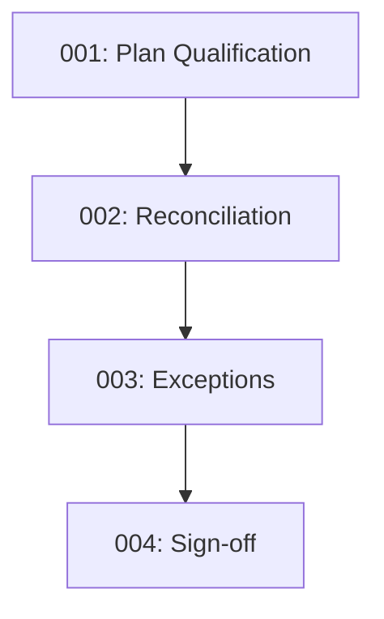

# `/process` — Plan Conversion Compliance Controls

This folder defines the **Plan Conversion Compliance Framework**: four sequential, auditable controls, plus templates and regulatory references.

## Controls

1. **[control_001_plan_qualification.md](./control_001_plan_qualification.md)** — Plan Qualification Framework (regulatory objective & reliance)
2. **[control_002_document_reconciliation.md](./control_002_document_reconciliation.md)** — Provision mapping & variance detection
3. **[control_003_exception_handling.md](./control_003_exception_handling.md)** — Variance tracking to closure
4. **[control_004_amendment_and_restated_plan_signoff.md](./control_004_amendment_and_restated_plan_signoff.md)** — Final execution, sign-off, archive

## Templates

Located in [`/templates`](./templates/):

- **[plan_comparison_workbook.csv](./templates/plan_comparison_workbook.csv)** — Side-by-side provision mapping (Control 002)
- **[exception_log.csv](./templates/exception_log.csv)** — Variance tracking ledger (Control 003)
- **[signoff_checklist.md](./templates/signoff_checklist.md)** — Execution package validation (Control 004)

## Documentation

- **[docs/references.md](./docs/references.md)** — Regulatory references (IRC, ERISA, Rev. Proc., DOL regs)

## Evidence produced

- Qualification Review Memo
- Plan Comparison Workbook
- Exception Log with approvals
- Executed Restated Plan Package (incl. Opinion Letter)

## Control flow

